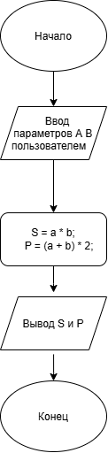

# Домашнее задание к работе 3

## Условие задачи
Написать и отладить программу, вычисления площади и
периметра прямоугольника со сторонами A и В, указанными
пользователем.

## 1. Алгоритм и блок-схема

### Алгоритм
1. **Начало**
2. Задать исходные данные:
   - `A` = `_` - Ширина прямоугольника введенная пользователем
   - `B` = `_` - Длина прямоугольника введенная пользователем
3. Вычислить площадь прямоугольника:
   - `S` = `A` * `B`
4. Вычислить периметра прямоугольника:
   - `Р` = (А + В) * 2;
5. Вывести результаты расчетов с подстановкой всех значений в текст.
6. **Конец**

### Блок-схема
 

 [Вставьте ссылку на изображение вашей блок-схемы, созданной в draw.io^](# "как lab_2_schema.png")

## 2. Реализация программы

#include <stdio.h>
#include <locale.h>
int main() {
    setlocale(LC_CTYPE, "RUS");
    //Шаг 1: задать переменные
    int a; //ширина
    int b; //длина
    //Шаг 2: ввести переменные
    printf("введите ширину\n");
    scanf_s("%d", &a);
    printf("введите длину\n");
    scanf_s("%d", &b);
    //Шаг 3: Посчитать площадь и периметр, вывести их результаты 
    int S = a * b;
    int P = (a + b) * 2;
    printf("Площадь прямоугольника = %d * %d = %d\n", a, b, S);
    printf("Периметр прямоугольника = (%d + %d) * 2 = %d\n", a, b, P);
}

## 3. Результаты работы программы

введите ширину
2
введите длину
3
Площадь прямоугольника = 2 * 3 = 6
Периметр прямоугольника = (2 + 3) * 2 = 12

## 4. Информация о разработчике

Балнов Артем бОТИ-262

